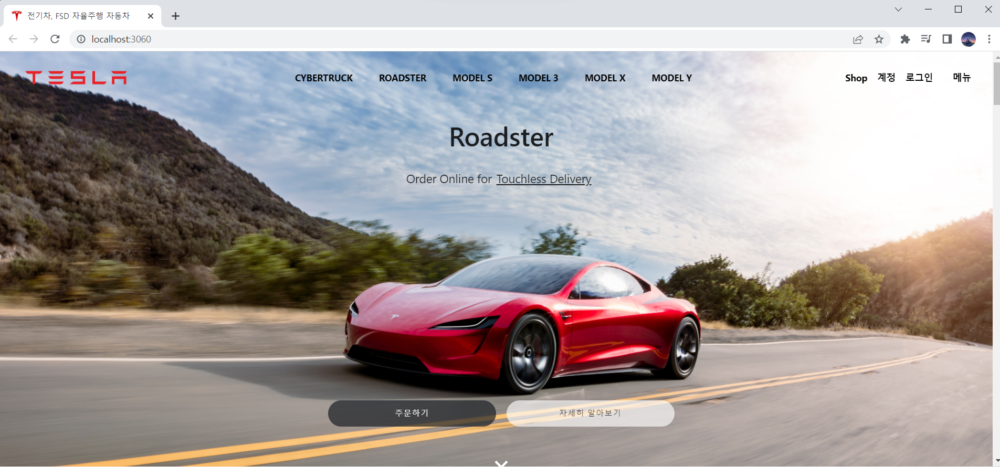

# 📦 Tesla-Clone

# 

- 전기자동차 및 자율주행 자동차 [테슬라(Tesla)](https://www.tesla.com/) 홈페이지 클론코딩

## 🧭 프로젝트 기간

- 2022 02.24 ~ 2022 03.4

## 🍯 코딩환경

</br>

| Name        | Description                                                                                         |
| ----------- | --------------------------------------------------------------------------------------------------- |
| `Front-End` | **JavaScript,**&nbsp; **React,**&nbsp; **Redux-Toolkit**,&nbsp; **styled-components** &nbsp; &nbsp; |
| `Back-End`  | **Node.Js,**&nbsp; **MySQL,**&nbsp; **Sequelize,**&nbsp; &nbsp;**Passport,**&nbsp;**Session**       |

<br/>
<br/>

## 📒 데모 영상

</br>

https://youtu.be/hrHiZ-qtLBk

</br>

## ⛏️ 사용된 기술

- **Redux-Toolkit**을 이용하여 상태관리
- **Mysql**과 **Sequelize**를 활용한 DB 관리

  </br>

- 메인 페이지

  - **material-ui**, **antd**, **styled-components**를 혼합 사용하여 기능에 맞는 디자인 적용
  - 스크롤 시 반응형 애니메이션 효과
  - Navigation Bar 및 도움말 슬라이더 목록 구현
  - **Next Router** / **Link**를 사용하여 네이게이션 기능 구현
  - Next를 사용하여 **SSR(Server Side Rendering)** 구현해 보기

  </br>

- 회원가입 & 로그인 기능

  - **Fomik**, **Yup** 라이브러리를 사용하여 Form 및 유효성 검사 간결화
  - axios 와 **Passport**를 사용하여 로그인 인증 및 bcrypt 보안 적용
  - **express session & Cookie**를 활용한 로그인 정보 불러오기

</br>

- 고객센터 & 문의내역 페이지

  - Redux-Toolkit과 Rest-API을 사용하여 프론트에서 문의사항을 백앤드로 전송 하면 MySQL DB에 문의 사항 저장
  - 문의내역 페이지에서는 **getServerSideProps**를 사용한 SSR가 실행되어 문의 내역을 불러옴
  - **day.js**를 라이브러리를 사용하여 문의내역 시간 보기

</br>

</br>

## 📜 설치 방법

</br>

### FrontEnd & BackEnd &nbsp;폴더 npm 설치

```sh
tesla-project\back npm install

tesla-project\front npm install
```

### BackEnd Sequelize Table Create

```sh
tesla-project\back npx Sequelize db:create
```

### FrontEnd & BackEnd 서버 실행

```sh
tesla-project\back npm run dev

tesla-project\front npm run dev
```

</br>

</br>
